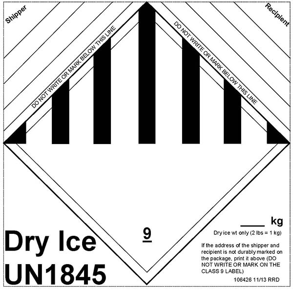

# package-sending

Occasionally, you'll have to send a package.

## Regular package

You'll need to find the following things:

* **Fedex US Airbill**: a shipping label. It says US Airbill on the top and is a 3-page carbon copy.
* **Plastic sleeve for Fedex label**: a clear plastic sleeve a little larger than the Airbill.
* **Dry ice label**: a white square sticker on a roll. If you're shipping dry ice, see below for more information.

These forms are usually at one of the Fedex dropoff sites:

* The most convenient one is just inside the main entrance to MCN. It's a large orange, purple, and white metal box, and is often half-buried in shipments waiting for pickup. Open the top door to find a bunch of slots where different Fedex forms are stored.
* There is another Fedex dropoff location in Robinson Research Building, room 574.

The office at the end of the 7th floor may have some as well, and if you really can't find any, then Peds Endo administrative assistants might have some.

Fill out the form with all the appropriate information. Peds Endo has a Fedex Account Number, so ask one of the [administrative assistants](https://github.com/moorelabvanderbilt/moorelabwiki/tree/98d9c43e779d8205afd02a9948443bf49c9a4a16/admin-asst/README.md) for it, or look at an old Fedex slip and copy the number off of it.

If you are shipping dry ice, the "Dangerous goods" section needs to be filled out differently. See the section below for more information.

When you've completed the form, tear off the top carbon copy and keep for your records.

Remove the backer from the plastic sleeve, and stick it to the box. Place the Airbill label inside the box.

Leave the package at one of the Fedex dropoff locations. The Fedex person picks up the packages around 4-5pm, so drop it off before then if you want it to go out the same day.

## Dry ice

On the Fedex US Airbill form, under "Does this shipment contain dangerous goods?", mark "Yes. Shipper's Declaration not required." Also mark in the box for "Dry Ice", and you'll fill in the weight after you add the dry ice to the box.

You also need one additional label. They are white square stickers with bold black lines in a diamond shape. They look like this:

These labels are usually in the same place as the Fedex dropoff, but if there are none there, you can also find a roll of them on the 7th floor of Light Hall, on a table just outside the elevators.

Fill out the sections with the appropriate addresses, and mark the weight of dry ice in kilograms. Mark this weight on the Airbill form as well.

For small packages, you can weigh the package on the scale before the dry ice is added, and then again after to figure out how many kilograms there are.

You can also estimate the kilograms of dry ice based on the volume of the box. There is approximately 0.026 kg per cubic inch of dry ice.

